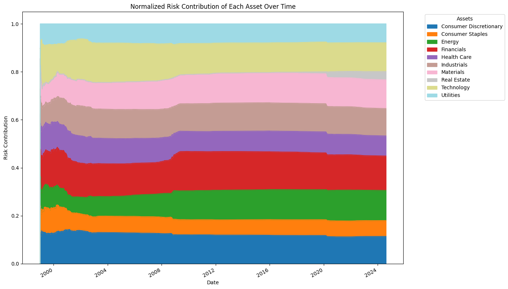

```python
from datetime import datetime

# U.S. Industry ETFs
us_industry_etfs = {
    "XLF": "Financials",                # Financial Select Sector SPDR Fund
    "XLK": "Technology",                # Technology Select Sector SPDR Fund
    "XLE": "Energy",                    # Energy Select Sector SPDR Fund
    "XLI": "Industrials",               # Industrial Select Sector SPDR Fund
    "XLU": "Utilities",                 # Utilities Select Sector SPDR Fund
    "XLP": "Consumer Staples",          # Consumer Staples Select Sector SPDR Fund
    "XLY": "Consumer Discretionary",    # Consumer Discretionary Select Sector SPDR Fund
    "XLV": "Health Care",               # Health Care Select Sector SPDR Fund
    "XLB": "Materials",                 # Materials Select Sector SPDR Fund
    "XLRE": "Real Estate"               # Real Estate Select Sector SPDR Fund
}

trading_days_in_year = 252
# Define the start and end dates for fetching the data
start_date = '1990-01-01'
end_date = datetime.today().strftime("%Y-%m-%d")
```


```python
!pip install pandas yfinance matplotlib seaborn
```

    Requirement already satisfied: pandas in /home/alan/Quantropy/env/lib/python3.10/site-packages (2.2.2)
    Requirement already satisfied: yfinance in /home/alan/Quantropy/env/lib/python3.10/site-packages (0.2.41)
    Requirement already satisfied: matplotlib in /home/alan/Quantropy/env/lib/python3.10/site-packages (3.9.1)
    Requirement already satisfied: seaborn in /home/alan/Quantropy/env/lib/python3.10/site-packages (0.13.2)
    Requirement already satisfied: python-dateutil>=2.8.2 in /home/alan/Quantropy/env/lib/python3.10/site-packages (from pandas) (2.9.0.post0)
    Requirement already satisfied: tzdata>=2022.7 in /home/alan/Quantropy/env/lib/python3.10/site-packages (from pandas) (2024.1)
    Requirement already satisfied: numpy>=1.22.4 in /home/alan/Quantropy/env/lib/python3.10/site-packages (from pandas) (2.0.0)
    Requirement already satisfied: pytz>=2020.1 in /home/alan/Quantropy/env/lib/python3.10/site-packages (from pandas) (2024.1)
    Requirement already satisfied: peewee>=3.16.2 in /home/alan/Quantropy/env/lib/python3.10/site-packages (from yfinance) (3.17.6)
    Requirement already satisfied: multitasking>=0.0.7 in /home/alan/Quantropy/env/lib/python3.10/site-packages (from yfinance) (0.0.11)
    Requirement already satisfied: lxml>=4.9.1 in /home/alan/Quantropy/env/lib/python3.10/site-packages (from yfinance) (5.3.0)
    Requirement already satisfied: beautifulsoup4>=4.11.1 in /home/alan/Quantropy/env/lib/python3.10/site-packages (from yfinance) (4.12.3)
    Requirement already satisfied: requests>=2.31 in /home/alan/Quantropy/env/lib/python3.10/site-packages (from yfinance) (2.32.3)
    Requirement already satisfied: frozendict>=2.3.4 in /home/alan/Quantropy/env/lib/python3.10/site-packages (from yfinance) (2.4.4)
    Requirement already satisfied: html5lib>=1.1 in /home/alan/Quantropy/env/lib/python3.10/site-packages (from yfinance) (1.1)
    Requirement already satisfied: platformdirs>=2.0.0 in /home/alan/Quantropy/env/lib/python3.10/site-packages (from yfinance) (4.2.2)
    Requirement already satisfied: pillow>=8 in /home/alan/Quantropy/env/lib/python3.10/site-packages (from matplotlib) (10.4.0)
    Requirement already satisfied: cycler>=0.10 in /home/alan/Quantropy/env/lib/python3.10/site-packages (from matplotlib) (0.12.1)
    Requirement already satisfied: pyparsing>=2.3.1 in /home/alan/Quantropy/env/lib/python3.10/site-packages (from matplotlib) (3.1.2)
    Requirement already satisfied: fonttools>=4.22.0 in /home/alan/Quantropy/env/lib/python3.10/site-packages (from matplotlib) (4.53.0)
    Requirement already satisfied: packaging>=20.0 in /home/alan/Quantropy/env/lib/python3.10/site-packages (from matplotlib) (24.1)
    Requirement already satisfied: contourpy>=1.0.1 in /home/alan/Quantropy/env/lib/python3.10/site-packages (from matplotlib) (1.2.1)
    Requirement already satisfied: kiwisolver>=1.3.1 in /home/alan/Quantropy/env/lib/python3.10/site-packages (from matplotlib) (1.4.5)
    Requirement already satisfied: soupsieve>1.2 in /home/alan/Quantropy/env/lib/python3.10/site-packages (from beautifulsoup4>=4.11.1->yfinance) (2.5)
    Requirement already satisfied: webencodings in /home/alan/Quantropy/env/lib/python3.10/site-packages (from html5lib>=1.1->yfinance) (0.5.1)
    Requirement already satisfied: six>=1.9 in /home/alan/Quantropy/env/lib/python3.10/site-packages (from html5lib>=1.1->yfinance) (1.16.0)
    Requirement already satisfied: idna<4,>=2.5 in /home/alan/Quantropy/env/lib/python3.10/site-packages (from requests>=2.31->yfinance) (3.7)
    Requirement already satisfied: certifi>=2017.4.17 in /home/alan/Quantropy/env/lib/python3.10/site-packages (from requests>=2.31->yfinance) (2024.7.4)
    Requirement already satisfied: urllib3<3,>=1.21.1 in /home/alan/Quantropy/env/lib/python3.10/site-packages (from requests>=2.31->yfinance) (2.2.2)
    Requirement already satisfied: charset-normalizer<4,>=2 in /home/alan/Quantropy/env/lib/python3.10/site-packages (from requests>=2.31->yfinance) (3.3.2)


```python
import pandas as pd
import yfinance as yf
import matplotlib.pyplot as plt

returns_df = pd.DataFrame()

# Fetch daily returns for each ticker
for ticker, asset_class in us_industry_etfs.items():
    try:
        # Fetch historical data for the ticker
        data = yf.download(ticker)
        
        # Check if the data is empty
        if data.empty:
            print(f"No data found for ticker: {ticker}")
            continue
        
        # Calculate daily returns
        data['Daily Return'] = data['Adj Close'].pct_change()
        
        # Add the daily returns to the returns DataFrame
        data = data[['Daily Return']].rename(columns={'Daily Return': asset_class})
        if returns_df.empty:
            returns_df = data
        else:
            returns_df = returns_df.join(data, how='outer')
    except Exception as e:
        print(f"Failed for ticker: {ticker}")
        print(e)
        
# Drop the first row with NaN values
returns_df = returns_df.iloc[1:]
returns_df.to_csv("../data/historical-class-returns.csv")
# Display the first few rows of the returns DataFrame

# VERY IMPORTANT, OTHERWISE MANY COMPUTATIONS WOULD RETURN NONE, FROM 
# PORT OPT, to RISK CONT!
returns_df.fillna(0, inplace=True)
returns_df.head()
```

    [*********************100%%**********************]  1 of 1 completed
    [*********************100%%**********************]  1 of 1 completed
    [*********************100%%**********************]  1 of 1 completed
    [*********************100%%**********************]  1 of 1 completed
    [*********************100%%**********************]  1 of 1 completed
    [*********************100%%**********************]  1 of 1 completed
    [*********************100%%**********************]  1 of 1 completed
    [*********************100%%**********************]  1 of 1 completed
    [*********************100%%**********************]  1 of 1 completed
    [*********************100%%**********************]  1 of 1 completed


<div>
<style scoped>
    .dataframe tbody tr th:only-of-type {
        vertical-align: middle;
    }

    .dataframe tbody tr th {
        vertical-align: top;
    }

    .dataframe thead th {
        text-align: right;
    }
</style>
<table border="1" class="dataframe">
  <thead>
    <tr style="text-align: right;">
      <th></th>
      <th>Financials</th>
      <th>Technology</th>
      <th>Energy</th>
      <th>Industrials</th>
      <th>Utilities</th>
      <th>Consumer Staples</th>
      <th>Consumer Discretionary</th>
      <th>Health Care</th>
      <th>Materials</th>
      <th>Real Estate</th>
    </tr>
    <tr>
      <th>Date</th>
      <th></th>
      <th></th>
      <th></th>
      <th></th>
      <th></th>
      <th></th>
      <th></th>
      <th></th>
      <th></th>
      <th></th>
    </tr>
  </thead>
  <tbody>
    <tr>
      <th>1998-12-23</th>
      <td>0.014745</td>
      <td>0.023891</td>
      <td>0.020819</td>
      <td>0.017450</td>
      <td>-0.004190</td>
      <td>0.024174</td>
      <td>0.004295</td>
      <td>0.022471</td>
      <td>0.010502</td>
      <td>0.0</td>
    </tr>
    <tr>
      <th>1998-12-24</th>
      <td>0.006605</td>
      <td>-0.003810</td>
      <td>-0.005263</td>
      <td>0.013193</td>
      <td>0.018412</td>
      <td>-0.001727</td>
      <td>0.018326</td>
      <td>0.006105</td>
      <td>0.023014</td>
      <td>0.0</td>
    </tr>
    <tr>
      <th>1998-12-28</th>
      <td>-0.013123</td>
      <td>0.002868</td>
      <td>-0.005291</td>
      <td>0.005208</td>
      <td>-0.005166</td>
      <td>-0.005767</td>
      <td>-0.008999</td>
      <td>-0.014563</td>
      <td>-0.008708</td>
      <td>0.0</td>
    </tr>
    <tr>
      <th>1998-12-29</th>
      <td>0.010638</td>
      <td>0.002860</td>
      <td>0.009973</td>
      <td>0.014249</td>
      <td>0.016615</td>
      <td>0.022042</td>
      <td>0.021792</td>
      <td>0.022167</td>
      <td>0.018301</td>
      <td>0.0</td>
    </tr>
    <tr>
      <th>1998-12-30</th>
      <td>-0.003947</td>
      <td>-0.003802</td>
      <td>-0.015141</td>
      <td>-0.004470</td>
      <td>-0.008172</td>
      <td>-0.006243</td>
      <td>-0.008294</td>
      <td>-0.008434</td>
      <td>-0.002875</td>
      <td>0.0</td>
    </tr>
  </tbody>
</table>
</div>


Previous example, notice how despite even weight allocation, risk contribution is diff per asset


```python
from portfolio_optimization import *
monthly_returns_df = (1 + returns_df).resample('ME').prod() - 1
# portfolio_returns = portfolio_allocation(returns_df, frequency='daily', method='eqCont')
# portfolio_returns = portfolio_allocation(returns_df, frequency='daily', method='minVol')
portfolio_returns, weights = portfolio_allocation(returns_df, frequency='daily', method='eqCont',
                                                               max_exposure=0.3)

post_processing = portfolio_performance(portfolio_returns=portfolio_returns, frequency="daily")
# Plot the risk contribution
plot_portfolio_risk_contribution_history(weights_df=weights, returns_df=returns_df)
```

    /home/alan/Quantropy/src/portfolio_optimization.py:191: FutureWarning: Downcasting object dtype arrays on .fillna, .ffill, .bfill is deprecated and will change in a future version. Call result.infer_objects(copy=False) instead. To opt-in to the future behavior, set `pd.set_option('future.no_silent_downcasting', True)`
      stored_weights_filled = stored_weights_shifted.ffill().fillna(0)
    /home/alan/Quantropy/env/lib/python3.10/site-packages/pandas/core/frame.py:11211: RuntimeWarning: Degrees of freedom <= 0 for slice
      base_cov = np.cov(mat.T, ddof=ddof)
    /home/alan/Quantropy/env/lib/python3.10/site-packages/numpy/lib/_function_base_impl.py:2773: RuntimeWarning: divide by zero encountered in divide
      c *= np.true_divide(1, fact)
    /home/alan/Quantropy/env/lib/python3.10/site-packages/numpy/lib/_function_base_impl.py:2773: RuntimeWarning: invalid value encountered in multiply
      c *= np.true_divide(1, fact)
    /home/alan/Quantropy/src/portfolio_optimization.py:272: RuntimeWarning: invalid value encountered in divide
      total_risk_contrib = marginal_risk_contrib / portfolio_volatility


    

    

